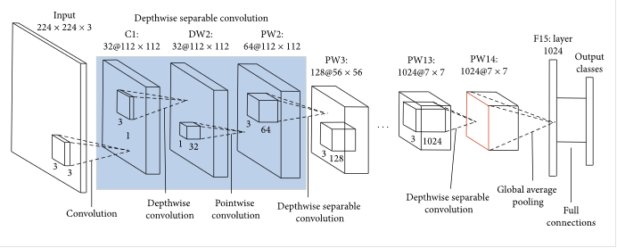

# Vision-Based Navigation for Autonomous Robotic Vehicles in Garage Environments: A Prototype Approach

## Project Overview

This project addresses the challenges of autonomous navigation in a garage environment by designing and implementing a 4-wheeled robotic vehicle. The vehicle is equipped with an Arduino board, a DC motor for driving, a servo motor for steering, a LiPo battery for power supply, and a mobile phone camera. The navigation algorithm relies on following a yellow dashed line on the garage map and utilizes a PID controller to correct the vehicle's path by minimizing the error between the detected yellow line centroid and the center of the camera frame. The vehicle also identifies its designated parking slot by recognizing numerical labels using a MobileNet convolutional neural network trained on a combination of the Chars74k dataset and various images captured from the garage map.

## Table of Contents

- [Project Overview](#project-overview)
- [Components](#components)
  - [Mechanical Parts](#mechanical-parts)
  - [Electrical Components](#electrical-components)
- [Software Architecture](#software-architecture)
  - [Programming Languages](#programming-languages)
  - [ROS Integration](#ros-integration)
- [Navigation Algorithm](#navigation-algorithm)
  - [Line Following](#line-following)
  - [Digit Recognition](#digit-recognition)
- [Results](#results)
- [Contact](#contact)
- [License](#license)

## Components

### Mechanical Parts

- **Chassis Design**: Built with LEGO pieces for easy adjustments.

  

  <i>Figure 1: Robot Vehicle Chassis Design </i>

  
- **Differential Gearbox**: Ensures smooth and efficient motion.
  

  
  

  

    <i>Figure 2: Differential Gearbox </i>
  

- **Direct-act Steering Mechanism**: Integrated with a servo motor for precise control.
  

  
  

  

    <i>Figure 3: Direct-Act Steering</i>
  

- **Couplers**: Custom-designed couplers connect the steering and driving mechanisms.

### Electrical Components

- **Arduino Mega 2560**: Microcontroller board for managing inputs and outputs.
- **BTS7960 (or L298N) Motor Driver**: Controls the speed and direction of the DC motor.
- **Li-Po RC Battery 12V**: Provides power to the system.
- **Servo Motor SG Tower Pro**: Adjusts the steering angle.
- **J Sumo DC Motor**: Drives the vehicle.
- **Mobile Phone Camera**: Captures video footage for navigation.
  

  
  

  

    <i>Figure 4: Circuit Design</i>
  

## Software Architecture

### Programming Languages

- **Arduino C**: For microcontroller programming.
- **Python**: For image processing and model training.

### ROS Integration

The project uses the Robot Operating System (ROS) for managing communication between different components:

- **Nodes**:
  - `camera_node`: Captures and publishes video frames.
  - `processing_node`: Processes video frames, detects lines and digits, and calculates control commands.
  - `communication_node`: Sends commands to Arduino and adjusts the servo motor and motor driver.

- **Topics**:
  - `/camera_frames`: Publishes video frames.
  - `/processing_results`: Publishes control commands.
    

    
    

    

      <i>Figure 5: ROS rqt_graph </i>
    

**Note**: We used the `pyserial` library instead of ROS Serial for sending commands from the laptop to the Arduino. This approach was chosen to have more direct control over the serial communication process, allowing us to customize the data handling and ensure compatibility with our specific hardware setup. While ROS Serial offers seamless integration with ROS, `pyserial` provided the flexibility needed for our project's unique requirements.

## Navigation Algorithm

### Line Following

The vehicle follows a yellow dashed line using the following steps:

- **Frame Processing**: Captures and processes video frames to detect yellow rectangles.
- **Error Calculation**: Calculates the error based on the deviation from the center.
- **PID Controller**: Adjusts the steering angle to minimize the error.
  

  
  

  

    <i>Figure 6: Original Image - HSV conversion - Resulted mask - Detected yellow rectangle</i>
  

### Digit Recognition

This project aims to develop a robust system for recognizing digits (1-9) in a garage parking area to assist a robotic vehicle in identifying parking slots. The system preprocesses images by isolating slot numbers based on color recognition. Subsequently, a convolutional neural network (MobileNet) is utilized for digit recognition. 
 

  
  

  

    <i>Figure 7: Original Image - HSV conversion - Resulted mask - Detected red digit</i>
  

#### Dataset

The project employs the MobileNet architecture, trained on a combination of the Chars74k dataset and images captured from the garage map. The Chars74k dataset includes over 74,000 digit images from various sources, categorized into 10 classes (0-9). It serves as a comprehensive resource for advancing numeric character recognition algorithms.
  

  
  

  

    <i>Figure 8: Data Sample</i>
  

#### Preprocessing Steps

1. **Normalization:** Pixel values scaled to [0, 1] by dividing by 255.
2. **Resizing:** Images resized to 224×224 pixels for compatibility with MobileNet.
3. **Data Augmentation:** Techniques such as random rotations and brightness adjustments applied to enhance model robustness.

#### Model Architecture

MobileNetV1 was selected for its efficiency in image classification tasks, leveraging depthwise separable convolutions to optimize performance. The model architecture includes:
- Input Layer: 224×224×3 input images.
- Depthwise Separable Convolutions: Reduces computational complexity.
- Convolutional Layers: With batch normalization and ReLU6 activation.
- Fully Connected Layer: Final dense layer with 10 output nodes for digit classification.
  

  
  

  

    <i>Figure 9: MobileNetV1 Model Architecture</i>
  

#### Training Procedure

The model was trained using:
- **Loss Function:** Categorical Cross-Entropy.
- **Optimizer:** Adam optimizer with a learning rate of 0.001.
- **Batch Size:** 32.
- **Epochs:** Trained for 10 epochs.

The architecture was customized by modifying the MobileNet output and adding a Dense layer for digit classification, optimizing training efficiency while leveraging pre-trained features.

## Results

The model achieved an accuracy of 98.58% and an F1-score of 0.9857 in digit recognition, demonstrating effective solutions for autonomous navigation and slot identification in a structured environment.
 

  
  

  

    <i>Figure 10: Confusion Matrix</i>
  

  
## Contact

- Jaafar Mayya: [jaafar.mayya@outlook.com](mailto:jaafar.mayya@outlook.com)
- Raneem Hassan: [raneem-hassan@outlook.com](mailto:raneem-hassan@outlook.com)
